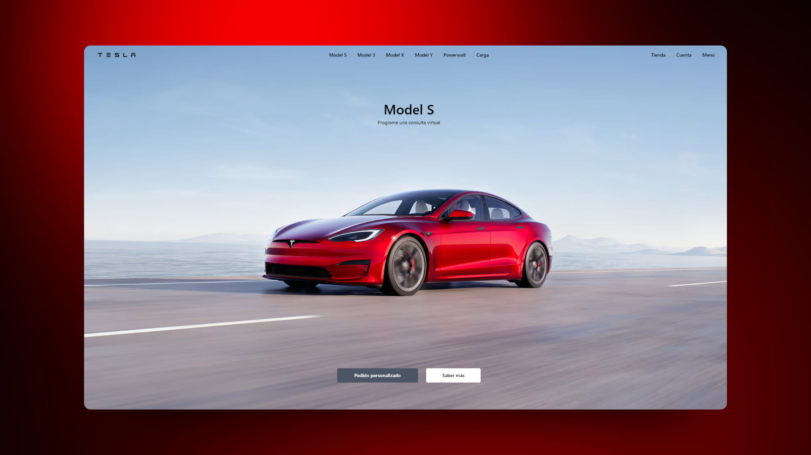

  
# 🚗 Astro: Tesla landing page

### Landing de la página de Tesla

> 🧩 Aquí puedes ver su [**Live Demo.**](https://tesla-landing-abraham.netlify.app/)

## 🚀 Descripción

Esta es una recreación de la página de **[Tesla España](https://www.tesla.com/es_es)** hecha con Astro y Tailwind, además de algo de código vanilla para acceder al DOM.

## 🎭 Tecnologías

El proyecto utiliza las siguientes tecnologías:

- **Intersection Observer API** para detectar el scroll del usuario.
- **Tailwind** para los estilos.
- Componentes de Astro para las diferentes secciones de la página.
